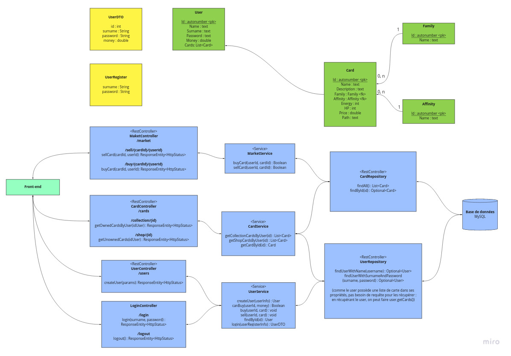

# ASI

###### GOUY Quentin | POULARD Antonin | VEBER Vincent | VERGNON Corentin

## Atelier 1

### Comparaison entre Web Statique + Web Services, Web Dynamique

| Critère | Web Statique | Web Dynamique
| ------ | ------ | ------ |
| Généralités | Un site web statique est composé de pages statiques dans le sens où leur contenu n'est pas dynamique. Qu'importe le contexte (utilisateur, OS, navigateur, heure, nombre de visites, etc.) la page sera toujours identique. Elle est donc stockée telle quelle sur le serveur et envoyée au client. | A l'inverse du Web Statique, le Web Dynamique pourra rendre une page différente selon les critères retenus. Une même page (URL) pourra donc donner plusieurs résultats selon ces paramètres. Il ne peut pas savoir à l'avance ce qu'il va renvoyer au client car elle "se contruit" dynamiquement lorsque le client la demande. |
| Difficulté de dévelopement | Les pages statiques sont très souvent bien plus simples à mettre en place. En effet, le contenu étant identique à tout moment, il suffit de construire et de remplir sa page comme on l'entend sans trop s'embêter. En revanche, ce n'est pas facile à maintenir si l'on doit souvent modifier le contenu des pages. | Plus complexes à mettre en oeuvre, les pages dynamiques sont bien plus adaptées aux contextes changeants (espace client, site de commerce, blogs, etc.) et donc par essence dépendant du contexte. C'est aussi plus résistant au changements car on doit pouvoir facilement les étendre et les maintenir à long terme. |
| Langages utilisés | HTML, CSS, JavaScript | JEE (JSP, Servlet, etc.), AJAX, ASP, PHP, Perl, HTML, CSS, Javascript, Typescript, Angular, React, Ember etc. |
| Base de données | Il n'y a pas besoin de base de données car les données sont directement écrites dans la page statique. | Il n'y a pas nécessairement de base de données même si on en retrouvera souvent. |
| Cas d'utilisation | Le Web Statique n'est pas meilleur ou pire que le Web Dynamique. Tout dépend du contexte et du cas d'utilisation. Le Web Statique sera plus adapté aux pages peu susceptibles de changer telle qu'un portfolio, une page vitrine de présentation, etc. Les pages statiques auront rarement des éléments intéractifs. En revanche, si l'on commence à devoir gérer beaucoup de pages statiques, il peut être intéressant de basculer vers du Web Dynamique. | Le Web Dynamique n'est pas meilleur ou pire que le Web Statique. Tout dépend du contexte et du cas d'utilisation. Le Web Dynamique sera plus adapté aux contextes changeants et lorsqu'il faudra s'adapter au client (on l'a dit, espace client, site de commerce, blogs, etc.). Il n'est pas utile de s'efforcer à faire du Web Dynamique si il n'y en a pas besoin. |
| Fréquence de mise à jour | Les moins souvent possible car cela implique d'aller modifier à la main le code source des pages. | Si le travail est bien fait, les pages n'ont pas besoin d'être mises à jour car c'est le contexte autour de ces pages qui les fait changer, pas la page elle même. |
| Performance | Très rapide à charger car tout est statique. | Plus long à charger de par sa nature dynamique. |

### Questions

#### Qu’est-ce que le pattern MVC ?

Le pattern MVC (Modèle-vue-contrôleur) est un motif d'architecture logicielle destiné aux interfaces graphiques lancé en 1978 et très populaire pour les applications web. Le motif est composé de trois types de modules ayant trois responsabilités différentes : les modèles, les vues et les contrôleurs.

Un modèle (Model) contient les données à afficher.
Une vue (View) contient la présentation de l'interface graphique.
Un contrôleur (Controller) contient la logique concernant les actions effectuées par l'utilisateur.

#### Quels avantages présente-t-il ?

L'utilisation du pattern MVC permet de standardiser la structure d'un projet afin d'améliorer sa maintenabilité et sa lisibilité. Il fait également sens d'un point de vue fonctionnel, en simplifiant le changement de technologie par exemple. chnager de technologie de base de données ne nécéssitera que la modification du model.

#### Qu’est-ce que le Web dynamique ?

Une page web dynamique est une page web générée à la demande, par opposition à une page web statique. Le contenu d'une page web dynamique peut donc varier en fonction d'informations (heure, nom de l'utilisateur, formulaire rempli par l'utilisateur, etc.) qui ne sont connues qu'au moment de sa consultation.

#### Pourquoi est-il intéressant ?

Il permet par exemple de personnaliser la page pour un utilisateur spécifique, la rendre interactive en fonction des actions effectuées sur celle ci.

#### Comment sont récupérés les fichiers par le Web Browser en Web statique ?

Le web browser récupère les fichiers avec un fetch et interprête ensuite dans le JS. (pas de traitement côté serveur)

#### Quels sont les avantages d’utiliser du Web Statique avec des services REST ?

La séparation du client et du serveur, les traitements sont fait côté serveur et non côté client, qui ne s'occupe uniquement de récupérer la réponse du serveur.

#### Comment fonctionne l’AJAX ?

Il récupère les données modifiées sur la page et modifie le DOM pour modifier la page sans nécéssiter un rechargement.

#### Qu’est-ce que JEE ?

L'objectif majeur de Java EE est de faciliter le développement d'applications web robustes et distribuées, déployées et exécutées sur un serveur d'applications.

#### Que représentent les Servlet dans JEE ? 

Un servlet est une classe Java qui permet de créer dynamiquement des données au sein d'un serveur HTTP.

#### Qu’est-ce que JSP ?

Le JavaServer Pages ou JSP est une technique basée sur Java qui permet aux développeurs de créer dynamiquement du code HTML, XML ou tout autre type de page web. Cette technique permet au code Java et à certaines actions prédéfinies d’être ajoutés dans un contenu statique.

#### Qu’est-ce qu’un Javabean ?

Il s'agit de composants logiciels réutilisables manipulables visuellement dans un outil de conception.

#### Que permet de faire JDBC?

JDBC est l'acronyme de Java DataBase Connectivity et désigne une API pour permettre un accès aux bases de données avec Java.

## Atelier 2

Schéma de l'architecture mise en oeuvre :

### Comparaison entre MVC (Model View Controller), SOA (Service-Oriented Architecture) et MicroService

| Critère | MVC | SOA | MicroService
| ------ | ------ | ------ | ------ |
| Généralités | Il s'agit de séparer le code en trois parties : le modèle (les données), la vue (la manière de représenter / d'afficher les données) et le contrôleur (les comportements et l'algorithmie (plus généralement la logique de l'application)). Finalement, c'est le contrôleur qui fait le lien entre le modèle et la vue. | Ici, il est question de services au service d'une entreprise. Ainsi, chaque application pourra se référer à ces services et donc réutiliser le code. Finalement, la principale différence entre MicroService et SOA est le champ d'application : dans le premier, on se réfère à l'application pour définir nos fonction alors que dans le second, c'est à l'échelle d'une entreprise. | C'est une architecture un peu plus poussée et "améliorée" du SOA. Ici, le principe de base est de séparer une grosse application en de multiples petits modules monofonction. Cela permet aussi une meilleure scalabilité puisque chaque microservice est séparé. Contrairement au SOA, on préférera copier coller le code d'un service à l'autre s'il permet un découplage total des services. |
| Base de données | Une seule base de données, avec la couche modèle qui se charge de récupérer les données et de les organiser. | D'une manière similaire au MVC, on ne retrouvera qu'une seule couche de données commune pour tous les services. | Comme il n'y a pas de couche commune de données entre chaque microservice, on retrouvera une base de donnée par microservice. Tout est encapsulé au niveau du microservice, ce qui permet, au final, de déployer voire de complètement revoir un microservice sans compromettre les autres microservices. |
| Communication entre les composants | Puisqu'il s'agit d'une architecture dite "monolithique", chaque partie est en relation directe avec l'autre. Toute l'application est hébergée sur un même serveur. | Ici, on emploie un ESB (Entreprise Service Bus) pour que chaque service puisse communiquer. Cependant, si ce point d'accès tombe, c'est toute l'entreprise qui est compromise. Souvent on passera aussi par le protocole SOAP accompagné de son fichier de définition WSDL, ce qui peut rapidement devenir un peu lourd face au REST. | Chaque microservice étant indépendant, ils dialogueront habituellement à l'aide de protocoles légers comme REST toujours dans le souci de garder les choses simples. |
| Points forts | Réutilisation facilitée du code, maintenance simplifiée, complexité du code atténuée. | Le code est réutilisé, les services peuvent facilement être étendus voire remplacés. | Résilience : un microservice qui tombe n'entraîne pas le reste de l'application avec lui. Scalabilité : le redimensionnement des microservices est facilité puisque chaque microservice est indépendant des autres. Agilité et productivité : on peut facilement constituer des équipes et faire évoluer chaque microservice sans impacter les autres. |

### Notes sur le docker postgres

On peut télécharger le docker sur https://hub.docker.com/_/postgres en lançant la commande `sudo docker run --name some-postgres -e POSTGRES_PASSWORD=mysecretpassword -d postgres`.

Une fois l'image lancée, on peut récupérer ses informations avec la commande `sudo docker inspect some-postgres`. Ainsi, on peut voir l'adresse IP sur laquelle postgres est lancé (ici 172.17.0.2).

On pourra alors modifier `application.properties` pour rajouter l'adresse IP et les informations de connexion idoines.

Attention, il faudra tout de même relancer la partie "insertion" du script de base de données avant de relancer l'application. Pour cela, on va utiliser pgadmin pour se connecter à la base de données et lancer la partie du script en question.